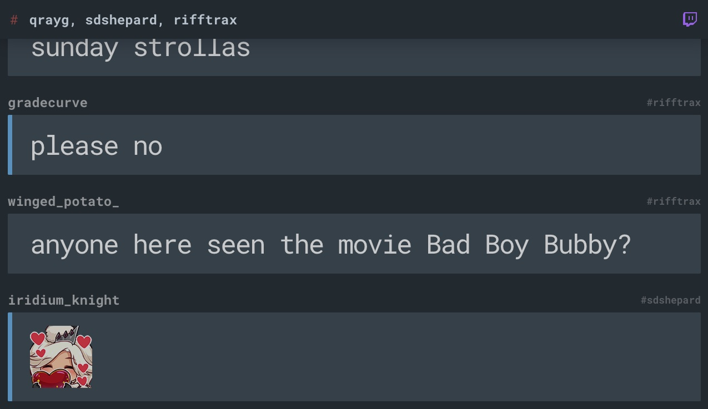

Features:
---
* Some Emote support. (I'm not sure why some Emotes just render their text equivalent, maybe that's normal?)
* Subscribers posts are highlighted with a left blue border.
* Broadcaster's posts are highlighted in a yellow border.
* USERNOTICE event posts are highlighted in a red background.

Usage:
---

1. Edit `index.html` and replace the `token` and `username` variables with your own Twitch credentials. You can generate an oauth token via [Twitch Chat OAuth](https://twitchapps.com/tmi). You can also edit the default value attribute on the `#channel` input field with a comma separated list of whatever chat channels you want to "watch".
2. Open `index.html` in your favorite browser.
3. Enjoy!

Todo
---

* __Custom Channels:__ Finalize the ability to type in your own list of a channels to connect to. It partially works right now, but there are some JS errors that can occur under certain scenarios... "this is beyond my skill to heal" ;)
